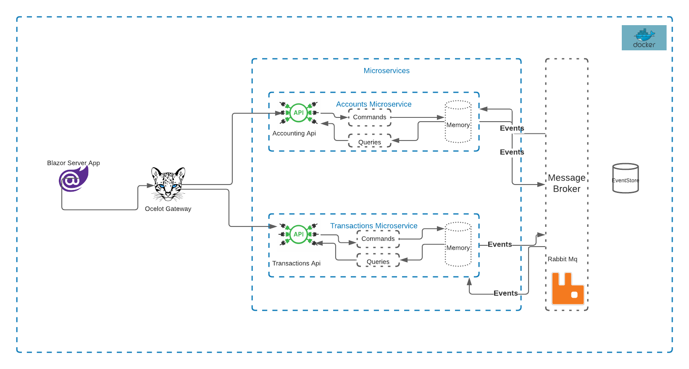

This is a sample application with Cqrs, microservices using Ocelot gateway and Blazor as ui.

Data is stored in memory for demonstration purposes and event sourcing part is not implemented yet.

Download the code and run in order

Accounting.Service
Transactions.Service
PublicGateway 
and 
BlazorUI app

<h3>Architecture</h3>

